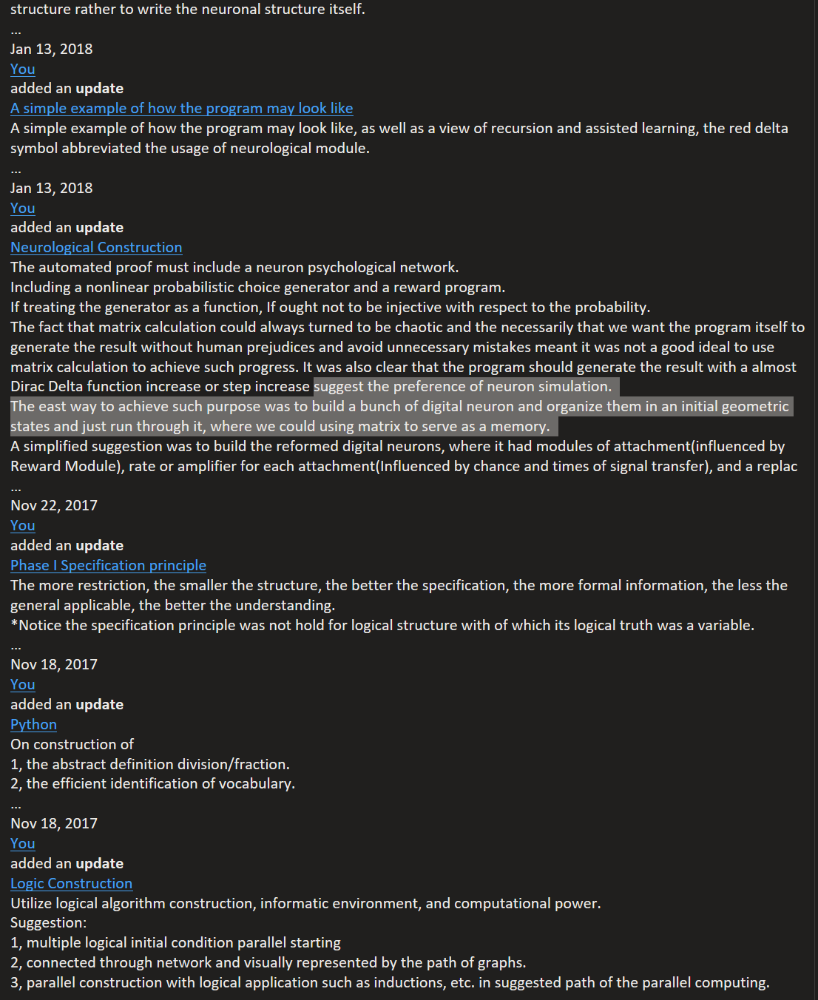

# secondgenAI
Some ongoing research on second-generation AI technologies, including large language models (LLMs) and generative AI technologies. Collaborations and active discussions are welcome. Please cite this work if you use or reference it.

-------------------------------------------------------------------------------------------------------------------------------------------------------------
Looking for job opportunities while continuing several research projects. Collaborations are welcome, including active discussions and constructive criticism. Public releases may be delayed compared to internal versions. Please cite and quote any information you use. Otherwise, some materials may be intentionally sent to the contenders of those who do not respect intellectual property. Some methodologies may be controversial, and occasional naive mistakes may appear as part of the research process.

-------------------------------------------------------------------------------------------------------------------------------------------------------------
2.8 Gen AI
1.	Entropy dynamics and mutual information based weights utilization method (entry level analysis and results)
2.	Algebra based functional analysis (entry level analysis)
3.	Mixed bitrate and weight quantization (entry level analysis and results)
4.	Improved MOE through information compactification and knowledgeable imprinting onto the decoders (entry level analysis)
5.	The increased native reasoning depths of the planners as part of the test time compute, may combine with the agentic workflow (medium level analysis)

test

